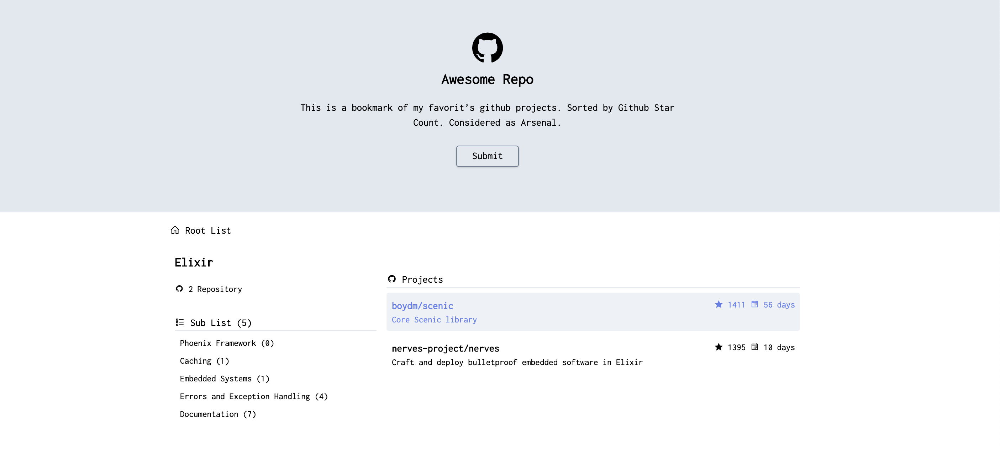

# AwesomeStuff

Personal bookmark of interesting Github Project and It's Development Status based on Category.

With this simple tools we can :

- [x] Create a List
- [x] Create a Sublist
- [x] Add Github Repo Link to a list
- [x] List of repo will be displayed ranked by star count.
- [ ] There are background process to update the last modified and star count of all the repo.

ToDo List
- [ ] Create Background process to update the repository metadata.

## Installation:

  * Clone this repo `git clone https://github.com/virkillz/awesome-stuff.git`
  * Go into folder `cd awesome-stuff`
  * Install dependencies with `mix deps.get`
  * Check your database setting at `config/dev.exs` and match your postgresql credential
  * Create and migrate your database with `mix ecto.create && mix ecto.migrate`
  * Install Node.js dependencies with `cd assets && npm install`
  * Run seed `mix run priv/repo/seeds.exs` (if you are from asset folder, dont forget to back to root project folder `cd ..`)
  * Start Phoenix endpoint with `mix phx.server`

### For User
Now you can visit [`localhost:4000`](http://localhost:4000) from your browser.
You can register as a regular user.

### For Admin
You can visit [`localhost:4000/admin`](http://localhost:4000/admin) and login using username 'administrator' and passsword 'administrator'

